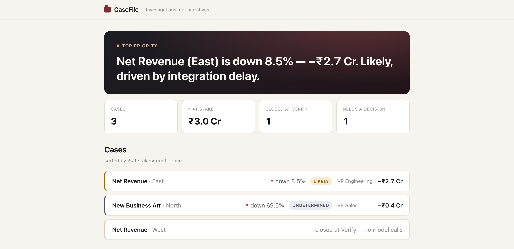

<div align="center">

# CaseFile

### An AI that *investigates* business numbers instead of narrating them.

**Accenture Innovation Challenge 2026 · Round 2 · Problem Track 3 — BusinessIntelligence.ai**
**Team Jerry · IIT Kharagpur**


*A deterministic pipeline that establishes facts, and calls a language model only where
language is the actual problem — three times, never for a number.*

</div>

<br>



<br>

## The problem

> A dashboard can show revenue dropped 8% in a region. It rarely says why, and the analyst
> who finds out spends days doing it — not analyzing, but **chasing evidence**: release logs,
> support tickets, six people who reply when they can. Worse, some of those alarming moves
> aren't even real — a refund batch, a changed metric definition, one invoice sliding across
> a month boundary. Explaining an artefact wastes the same three days and quietly costs trust
> once discovered.

**The gap platforms leave open isn't description. It's evidence.**

## The insight

> ## Don't summarise the KPI. Open a case.

Every "AI explains your dashboard" product shares one failure mode: it always produces a
narrative, confident and fluent, because generating text is the only thing it does. It
cannot return *"I don't know."*

CaseFile behaves like an investigator instead — establish facts first, test explanations
against them, and be willing to close a case unresolved:

> ### Exhaust the arithmetic before invoking hypotheses.

Revenue fell 8%. We don't ask a model *why* — we first ask *where*. If 88% of the decline
sits in two enterprise renewals, an unanswerable question has become a focused one. **Only
then** do we test why those two renewals stalled, and only against cited evidence a
falsification test can actually knock down.

## Why this isn't Tableau Pulse with extra steps

| Platform-native narrators (Pulse, Genie, Cortex Analyst, Spotter) | CaseFile |
|---|---|
| Detect and describe the movement | **Verifies the movement is real** before explaining anything |
| One generated narrative | Four falsification tests; decoys eliminated with cited evidence |
| Always produces an answer | **Abstains** — with the discriminating question, its owner, and its value |
| Redaction at the prompt layer, if at all | Entitlement applied to the case object *before* narration |
| Insight | Action with an owner, a ₹ figure, and a monitoring plan |

They are detection-and-description layers. **CaseFile begins where they stop: after the
alert, before the decision.**

---

## How an investigation runs

```
Trigger → VERIFY → DECOMPOSE → INVESTIGATE → CHALLENGE → DECIDE
```

| | Question | What closes here |
|---|---|---|
| **01** | **Is it real?** | Freshness, completeness, definition drift, single-record artefacts. Most systems never ask — many "crises" die here, for **zero model calls** |
| **02** | **Where did it come from?** | Pure arithmetic — the movement is decomposed until contributors are visible, and everything downstream is scoped by it |
| **03** | **Why did it happen?** | Every hypothesis from the KPI's driver registry is tested against cited evidence on four axes: **timing · locality · dose · control** |
| **04** | **What should we do?** | An action with an owner and a ₹ figure — or the one missing fact that would settle it, and who to ask |

A case can close at *any* stage. Not every alert earns a deep investigation, and CaseFile is
built to say so rather than manufacture one.

### Four verdicts, never one grade

| Verdict | What it means |
|---|---|
| 🟢 **Confirmed** | Control passes, ≥2 other tests pass, nothing contradicts |
| 🟡 **Likely** | Survives elimination; Control is inconclusive — the honest, common case |
| 🔴 **Contested** | ≥2 hypotheses reach Likely with conflicting evidence — both are shown |
| ⚪ **Undetermined** | A **success state**, not a failure: the evidence can't decide, and the case returns the exact question that would settle it |

> **`Likely — not Confirmed` is the most important line CaseFile ever writes.** With two
> accounts, the Dose test structurally cannot pass — and the system says so on the case
> instead of rounding up to a grade it hasn't earned.

---

## See it in action

A real case (`run_case()` on the committed synthetic corpus, no hand-authored fixture):
open the top case, read the falsification tests, switch to a restricted persona.


What that walkthrough shows, in order:

- **The verify signal, answered on the page.** "Is it real?" isn't rhetorical — the case
  states its freshness and every check it passed before a single hypothesis is tested. A
  50-account contribution tail collapses to what actually matters instead of dumping all of
  it flat.
- **The honesty moment.** The verdict is `Likely — not Confirmed`, and the case states the
  exact reason it isn't Confirmed, right next to the grade — never a bare label.
- **Cited evidence, not a paragraph.** Each hypothesis carries four falsification tests —
  timing, locality, dose, control — each row backed by a real number and a source link.
- **Four truths, one investigation.** Switching to the Support Lead persona shows hashed
  account names and banded amounts, with the redaction stated on the page, never silent —
  entitlement runs *before* narration, not after.

---

## Technical architecture

Twelve stages. `DET` = deterministic code · `LLM` = schema-enforced model call · `HYB` = both.

```
  billing (daily) ─┐
  crm (24h)         ├─▶ S0 CONFORM ─▶ S1 VERIFY ──▶ [CLOSE: not real / not material]
  product_ops (≤15m)┘      DET           DET               zero LLM calls, zero cost
                                          │
                                          ▼
                                S2 DECOMPOSE  DET  ◀── the pivot, pure arithmetic
                                          │
                                          ▼  FOOTPRINT {entities, window, Δ}
                                S3 HYPOTHESISE  HYB   (registry enumerates · LLM #1 annotates)
                                          │
                        ┌─────────────────┴─────────────────┐
                        ▼                                   ▼
               S4a PROBES  DET                      S4b RETRIEVAL  DET
               (SQL + absence)                      (footprint filter → BM25)
                        └─────────────────┬─────────────────┘
                                          ▼
                                S4c EXTRACT  LLM #2
                                          │
                                          ▼
                                S5 CHALLENGE  DET   (timing · locality · dose · control)
                                          │
                                          ▼
                        S6 ADJUDICATE → S7 RECOMMEND → S8 ENTITLE (DET) → S8b NARRATE (LLM #3)
```

### The LLM boundary — the brief's own instruction, instrumented

> *"The LLM should not be treated as the source of quantitative truth."*

Three of twelve stages touch a model — **and none of the three produces a number or decides
what gets tested**:

| Stage | Method | Why |
|---|---|---|
| **Hypothesise** | Registry enumeration + LLM annotation | The tested set is a deterministic function of the contract; the model adds rationale and may flag one `unmodelled` driver — it never removes a suspect |
| **Extract** | LLM, schema-forced | Language → structure, with a `doc_id` and a quoted span on every claim |
| **Narrate** | LLM, per persona | Over facts already filtered by entitlement, with numbers interpolated from the case object |

Everything else — verification, decomposition, probes, retrieval ranking, the four
falsification tests, adjudication, recommendation, entitlement, telemetry — is SQL,
arithmetic, statistics, or set operations. Stage 10 measures the split per case rather than
asserting it, so the LLM/non-LLM ratio is a property of the data, not a slide.

### Stack

| Layer | Choice | Why |
|---|---|---|
| Language | **Python 3.11** | Statistical ecosystem |
| Store | **DuckDB** | Real SQL, file-based, no service to run — one engine for warehouse, evidence ledger, and case store |
| Types | **Pydantic v2** | Contract, evidence, verdict, *and* LLM output-schema enforcement, for free |
| Statistics | **statsmodels + scipy** | STL, PELT change-point, Spearman, difference-in-differences |
| Retrieval | **rank_bm25** (default) | Decomposition-scoped, not whole-corpus — see below |
| LLM | **Provider-agnostic** (Anthropic default; Gemini/Groq behind an extra) | Every call schema-enforced, every call returns `Usage`, replayable offline from `llm_cache/` |
| UI | **React + Vite**, fixture-driven | Five screens; today it reads golden `Case` objects directly — the orchestrator swaps that import for a live API call with no screen underneath changing |

---

## Scalability, accuracy, and real-world fit

- **Decomposition-scoped retrieval, not whole-corpus RAG.** Arithmetic already knows the
  movement lives in two named accounts over a six-week window — retrieval filters by entity
  and date *before* semantic search. ~65k documents → ~1–1.3k candidates → top 15 by BM25.
  Measured recall@15 = **1.000** on every driver in the authored evidence set, at
  **≈14.5k input tokens per case** versus ~200k for whole-corpus RAG — **10–15× cheaper as an
  architectural consequence, not a bolted-on optimisation.**
- **The warehouse is a connector swap, not a rewrite.** Every quantitative stage is plain SQL
  against DuckDB; the aggregation logic moves to Snowflake or Databricks unchanged. Three
  probe files lean on a DuckDB-specific array idiom and would need a dialect rewrite alongside
  the swap — stated plainly, not glossed over.
- **Decomposition is checked against a public benchmark, not self-graded.** The load-bearing
  stage is designed to be scored against the public Squeeze/RiskLoc semi-synthetic benchmarks
  against published Adtributor/HotSpot baselines — the one number this team doesn't get to
  grade itself. *(Benchmark run planned; not yet published — flagged honestly, not implied.)*
- **Built to run continuously, not just once.** `scan.py` sweeps every KPI × region slice on
  a cadence, `casestore.py` persists every scanned case for audit, and a provisional case
  automatically re-adjudicates when a late watermark lands — the daily-loop story isn't just
  a narrative, it's `make scan` / `make replay` / `make ingest` against the real pipeline.
- **Seven seeded scenarios** prove the behaviours that matter most: a multi-factor movement
  with two decoys (A), a cause the sources genuinely can't see → honest Undetermined (B), an
  8-month KPI with no seasonal baseline (C), a refund batch and a metric-definition change
  both closing at Verify for zero model calls (D, E), row/column/domain redaction (F), and two
  causes with identical footprints neither test can separate → Contested, both shown (G).

## Impact, measured

| | |
|---|---|
| Alert → closed case | **< 10 seconds** |
| Cost per case | **< ₹10** (≈₹8 at Sonnet-class pricing; ≈₹3 at Haiku-class) |
| Stages producing numbers without a model | **100%** |
| Claims without a traceable source | **0** |
| Evidence assembly | ~3 days of chasing people → seconds, plus at most one targeted question with a named owner |

Every one of these is read from the pipeline's own telemetry, per case, every run — not a
projection. What that's worth to a real team's decision cycle is exactly what a pilot exists
to measure next.

---

## Quick start

```bash
git clone https://github.com/JitamB/CaseFile.git && cd CaseFile
python3 -m venv .venv && source .venv/bin/activate && make setup
make data && make demo      # one case, end to end — no API key needed, replayed from llm_cache/
```

Full sequence (setup → continuous scan/ingest → UI): **[docs/running-the-project.md](docs/running-the-project.md)**.

## Documentation

The full plan lives in [`docs/`](docs/README.md); cross-references in that plan use `§N`,
resolved by [its own index](docs/README.md).

| | Document | Covers |
|---|---|---|
| 01 | [**Problem & Solution**](docs/01-problem-and-solution.md) | The problem underneath, the four verdicts, the worked example |
| 02 | [**Architecture**](docs/02-architecture.md) | Three artifacts, twelve stages, the LLM boundary, cost |
| 03 | [**Data**](docs/03-data.md) | Data strategy, the six KPIs, the generator, seeded scenarios |
| 04–09 | **Team, execution, testing, outcome, glossary, build protocol** | [Full index →](docs/README.md) |
| — | [**Running the project**](docs/running-the-project.md) | The complete command sequence, setup to UI |
| — | [**Continuous operation**](docs/continuous-operation-plan.md) | Scan, scheduler, case store, incremental ingestion |
| — | [**Business proposal deck**](docs/10-business-proposal-presentation.md) | 20-slide, presentation-ready pitch |
| — | [**Decision log**](docs/DECISIONS.md) | Every real finding, dated, as it happened |

## Team

**Team Jerry — IIT Kharagpur**

| Member | Track | Owns |
|---|---|---|
| **Aditya Goyal** | **A · Data & Truth** | Everything that produces a number — contract, generator, loader, statistics, Verify, Decompose |
| **Jitam Barman** | **B · Evidence & Reasoning** | Everything between a footprint and a verdict — hypotheses, retrieval, extraction, challenge, adjudication, recommendation, the LLM layer |
| **Sahil Kumar Gupta** | **C · Surface & Delivery** | Everything a human touches — orchestrator, API, entitlement, narration, personas, UI, feedback |

---

<div align="center">

**Dashboards tell businesses what changed.**
**CaseFile tells them what to believe, what to question, and what to do next.**

</div>
